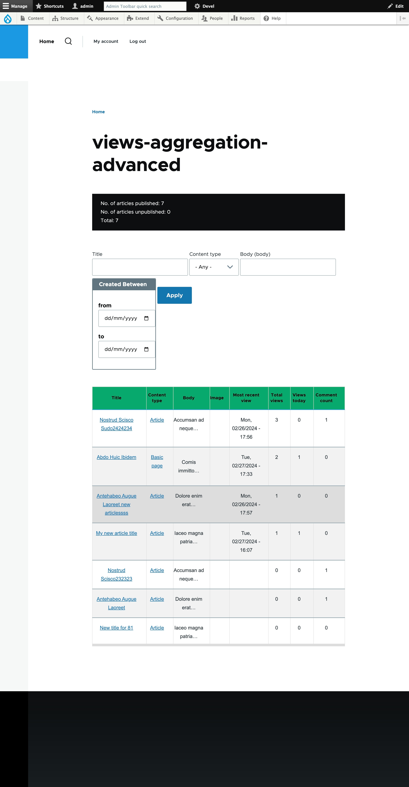

# Advnaced View

## Installing the module 

Activate the `advanced_view` module from drupal admin

## Usage

- Install pre requisite modules: statistics, datetime_range,date_filter 

- Import the view : copy config/views.view.views_aggregation_advanced.yml to the config folder and do `drush cim -y`. Enable the `update` module and export it, if it show a warning on import.

- Install the theme (olivero_extended) and activate it.

- Go to `admin > Configuration > User Interface > Advanced view aggregations` to access the view.

## Implementation details

-  View is aggregated with article fields.

-  Added the exposed filters to the `title`, `type` and `Body` fields.

- Contextual filter added to the `Authored by` field so that when a user logged in he can see the content created by him only.

- To implement date range filter enable `datetime_range`, `date_filter` modules and apply to the `authored on` filter field.

- Total views, Views today, Comment count per each article/ pages has been added as part of statistics. Core `statistics` module needs to be enabled for this

- Added Header text to the view as total published article count , total unpublished article count utilizing the `hook_views_pre_view` hook.

- The access is controlled by a custom access plugin (`AdvancedViewAccess`) which is configured in the view's `Page settings` section. The access will be allowed only to the permission defined (`advanced_view.access`) users.

- To view the content statistics fields(Most recent view, Total views, views today) for other role users , enable `View content hits` permission for that role.

- The view template has been extended using the template `web/themes/olivero_extended/templates/view/views-view-table.html.twig` 

