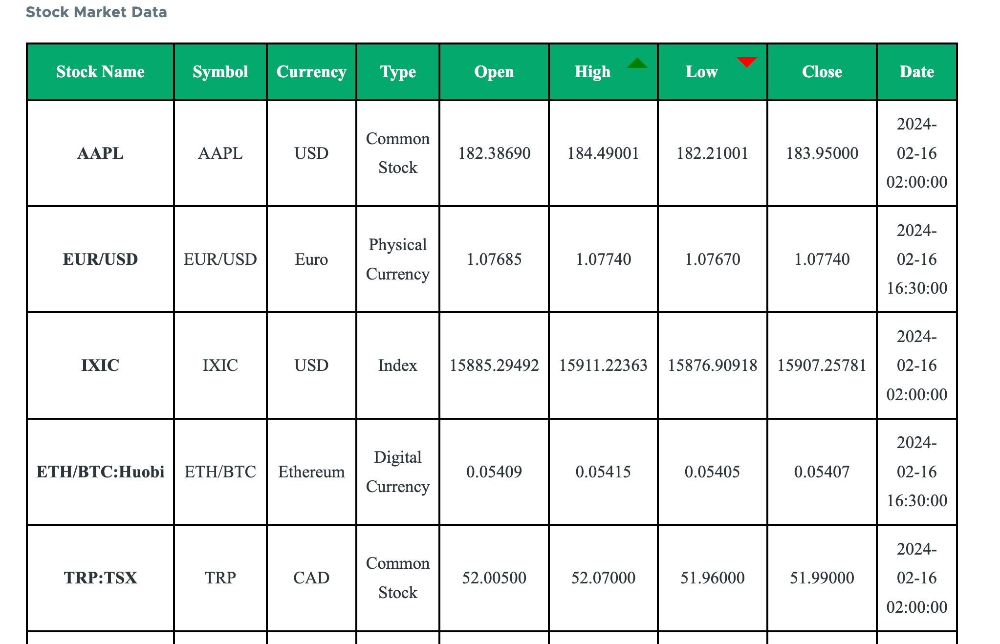

# Custom block plugin

## Using the block

- Enable the module `custom block_plugin`.
- Go to admin > strucuture > Block layout and search for 
`Stock Market Data` and place it in a region (say sidebar or content)

-  Created block plugin that will a live stock market from external API

-  Defined a service to fetch the stock market data from external API.

-  Defined library and css to style the block display.

