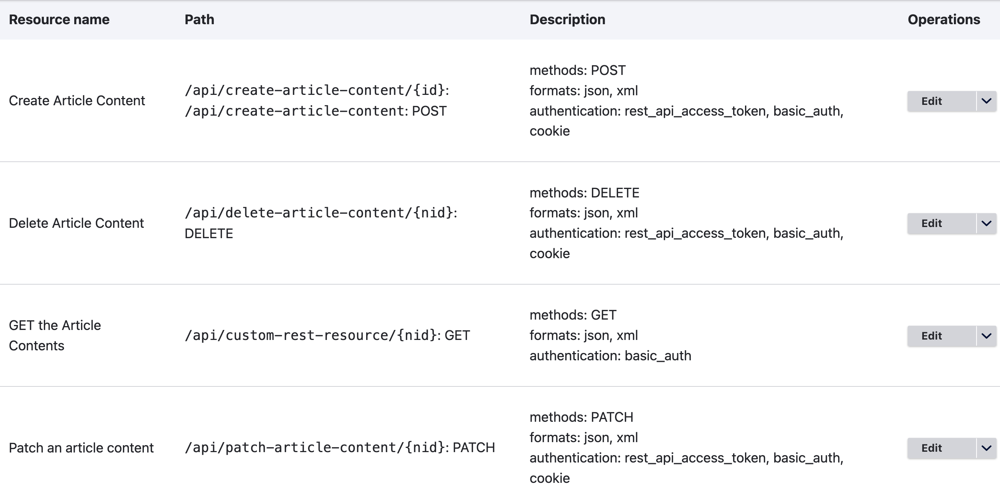
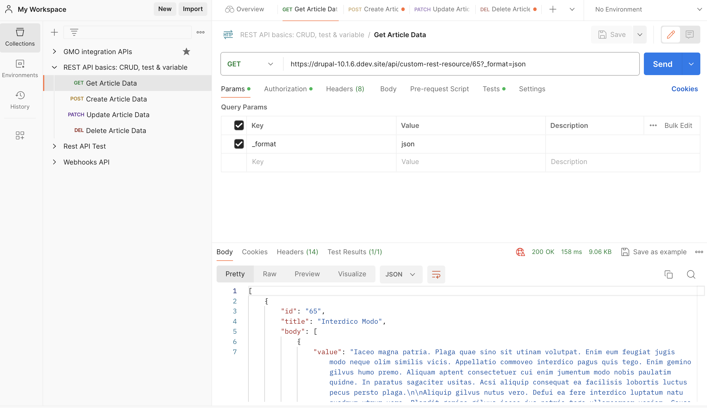
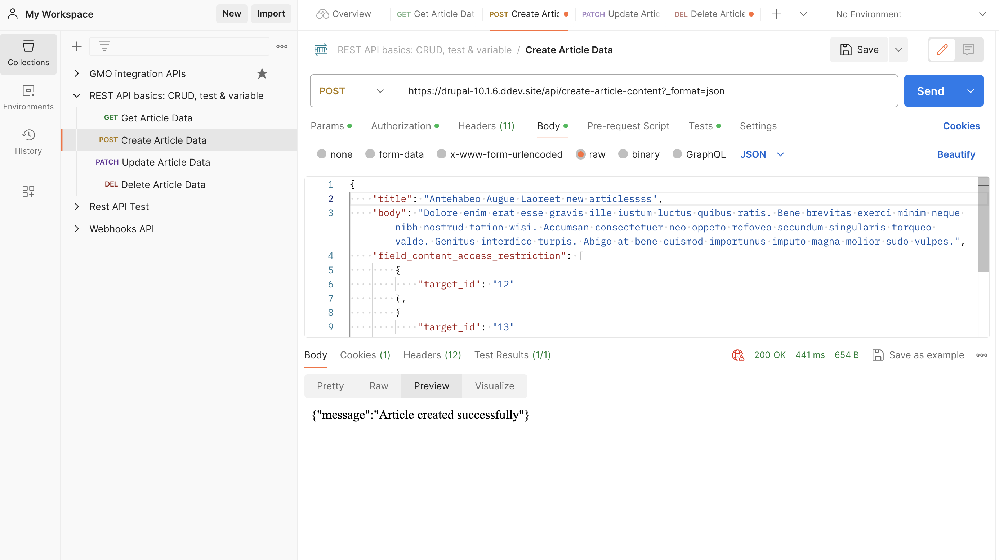
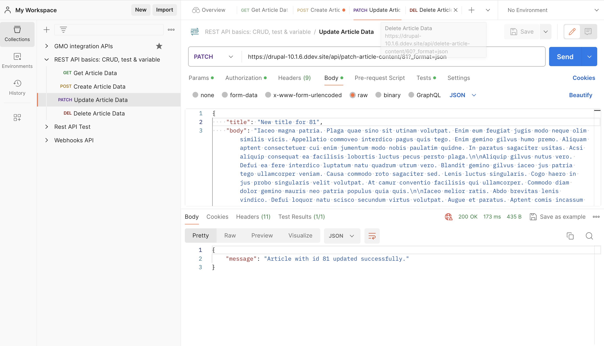
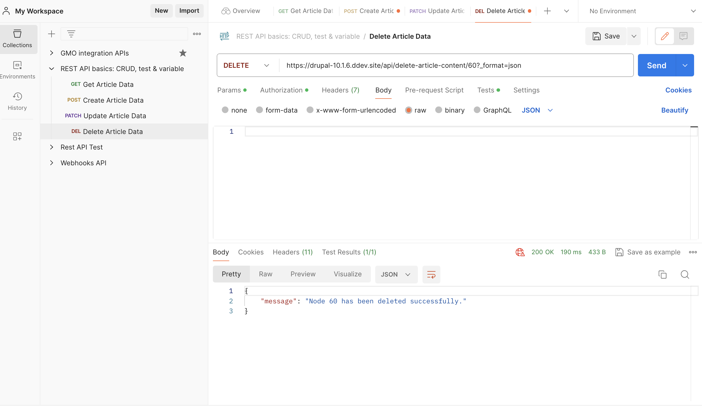

# Custom RESTful services

This module will create the drupal REST service to 
expose the data via a webservice using different HTTP 
methods (GET, POST, PATCH, DELETE) defined in plugin/rest/resource.

## Using the Module

Enable the module: 
``` 
ddev drush en custom_restful_service
```

Go to /admin/config/services/rest and enable all the endpoints defined.


## API endpoints

- GET: `https://drupal-10.1.6.ddev.site/api/custom-rest-resource/80?_format=json`

    This endpoint will get the data of a specific node when passing the node id.
    

- POST: `https://drupal-10.1.6.ddev.site/api/create-article-content?_format=json`

    This endpoint will post the data to create the article content.
    

- PATCH: `https://drupal-10.1.6.ddev.site/api/patch-article-content/81?_format=json`

    This endpoint will update the article with a PATCH request.
     

- PATCH: `https://drupal-10.1.6.ddev.site/api/delete-article-content/60?_format=json`

This endpoint will delete the article using DELETE 
request by passing the node id.
     