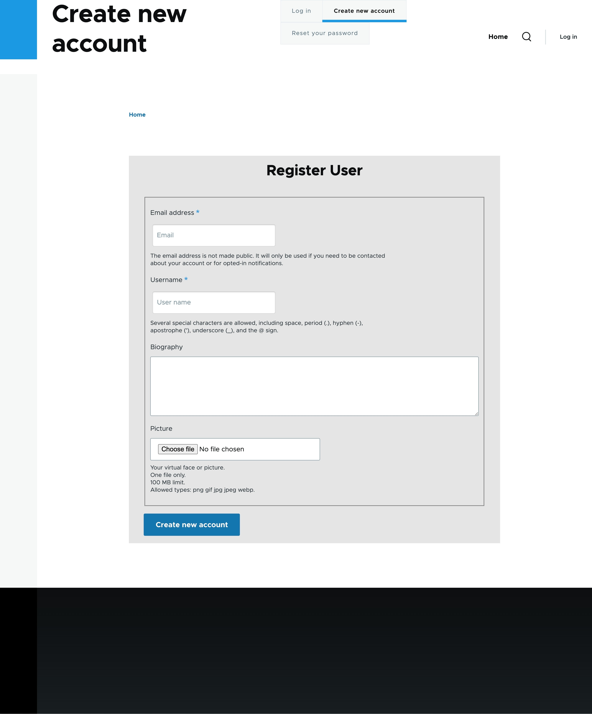

## Installing the theme 

Activate the `custom_theme_registration` theme from drupal admin

## Registration Page

Logout and take `Create new account` from  Login menu

-  Used `hook_theme_suggestions_alter` hook to add the form suggestions.

-  Used `templates/form/form--user-register-form.html.twig` 
to style the form with custom css defined via library 
to enhance look and feel.

- Added JS to add placeholders to the email and username fields.

- Added Media Queries to add responsiveness to small 
devices(Mobile S - 320px , Mobile M - 375px).

