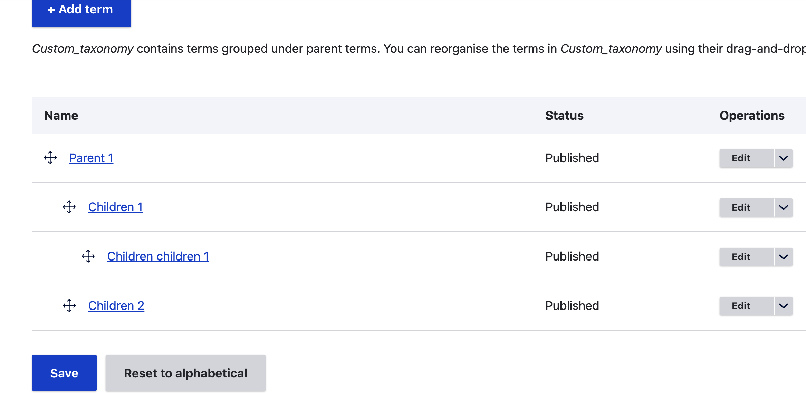

# Hierarchial taxonomy migrate

# Enabling and using the module

- Enable the module `custom hierarchial_taxonomy_migrate`.
- Import the configurations: `drush cim -y`
- Create a taxonomy vocabulary named: `custom_taxonomy`
- Go to admin > strucuture > Migrations and you can see 
`Import term taxonomy` and `Set parent taxonomy`. 
Run both migrations or via drush: 
    - `ddev drush mim taxonomy`
    - `ddev drush mim taxonomy_parent`
- You can see a hierachial structure of taxonomy terms 
created under `custom_taxonomy` as follows.

- To import the hierachial terms via csv , import the 
migrations and run the drush command : 
`ddev drush mim hierarchical_terms_import_from_csv`. 
To import via csv there is one dependency: 
migrate_source_csv(https://www.drupal.org/project/migrate_source_csv)

