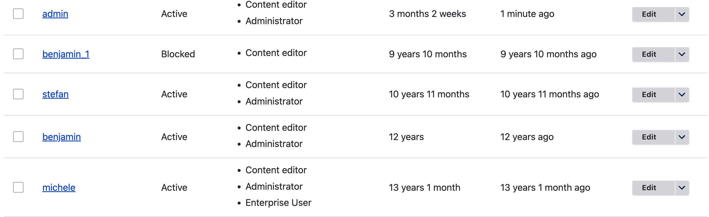
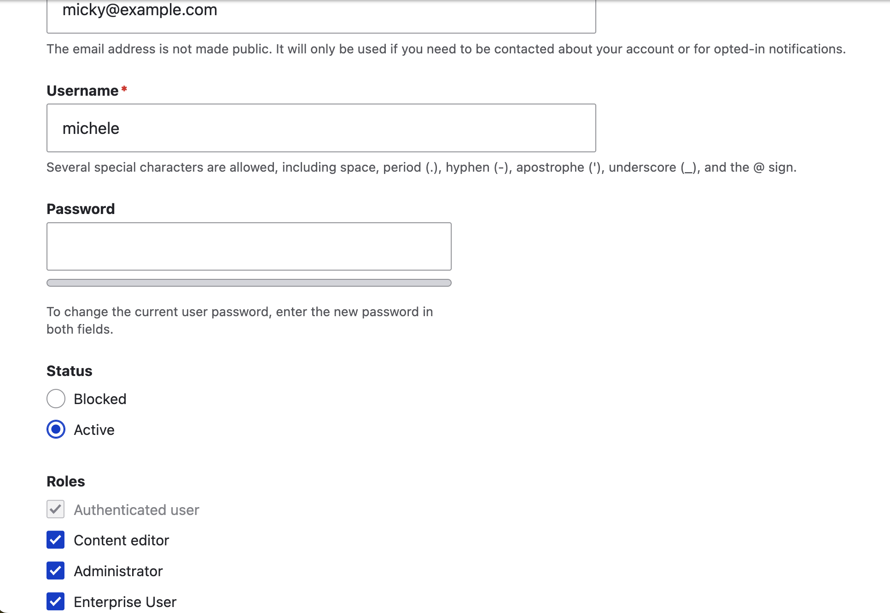

# User Migration

In this module we will migrate the user data with custom fields

## Using the Module

Enable the module: 
``` 
ddev drush en user_migration_custom
```
Export the configurations via drush : `ddev drush cex -y`

## Running the migrations

- Go to admin > strucuture > Migrations. Run both migrations 
(User pictures migration, Custom user migration) via UI or via drush: 
    - `ddev drush mim user_pictures_migration`
    - `ddev drush mim custom_user_migration`


