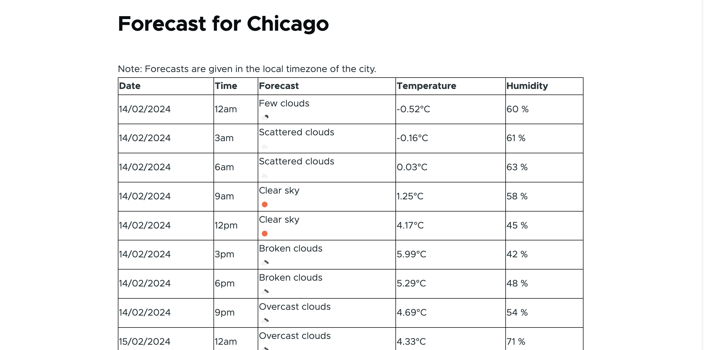

# Weather forecast

## Installing the module 

Activate the `weather_forecasr` module from drupal admin

## Usage

- Go to Admin > Configuraton > User Interface > Set Forecast Configuration to the configurations such as (city, interval to fetch the data)

- Admin > Configuraton > User Interface > Show forecast to see the tabular data of the weather forecast for the specified city.

- Used service to get the data from external API

- Added templates and libraries and css to add look  and feel to the data displayed

